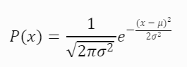
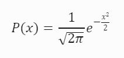

# Zero Expectation Role Playing System
Role playing system based on normal (Gaussian) distribution with zero mean (zero expectation) and unit sigma.

In a Computer Role-Playing Game (CRPG), both normal distribution random generation and dice rolls serve as methods for introducing randomness and uncertainty. Let’s explore the advantages of using normal distribution random generation over traditional dice rolls.

- The normal distribution (also known as the Gaussian distribution) is symmetric and bell-shaped. This shape is useful because it can **describe many real-world populations**.

- It is easier to calculate probabilities, percentiles, and cumulative distribution functions. In contrast, dice rolls involve discrete probabilities.

- CRPG designers can adjust the mean and standard deviation of the normal distribution to **fine-tune game balance**. For example, adjusting the damage dealt by weapons, critical hit chances, or skill checks. Dice rolls, while iconic, may be less flexible for precise balancing. Dice rolls are inherently discrete. A six-sided die gives you six possible outcomes.

- Normal distribution outcomes feel more continuous and natural. Critical hits, misses, and other events can be narratively explained based on statistical probabilities.

- Continuous skill levels enhance storytelling. Instead of saying, "You rolled a 15; you succeed," we can say, "Your finely honed lockpicking skill allows you to deftly manipulate the tumblers." This adds flavor and depth to the narrative.

# What is Normal Distribution?

**TL;DR**: Imagine you’re rolling a regular six-sided die. Each number (1 to 6) has an equal chance of showing up. The total you get from rolling two dice (like 2, 3, 4, ..., up to 12) follows a pattern similar to the bell curve. Common totals (like 7) are more probable, while extreme outcomes (like 2 or 12) are rare. In real-world scenarios, data often follows a bell curve. Most values cluster around the **mean**, and extreme values are less common. The **standard deviation** controls how spread out the data is.

The **normal distribution**, also known as the **Gaussian distribution**, is a fundamental concept in probability theory and statistics. Let’s delve into its properties, uses, and advantages.

## Definition and Properties:

The **normal distribution** is symmetric about the **mean**, which means that data near the mean occur more frequently than data far from it.

Graphically, it appears as a bell curve.

### Key features:
- **Mean**, **median**, and **mode** are equal and represent the peak of the distribution.
- The distribution falls symmetrically around the mean.
- Width is defined by the **standard deviation**.
- All normal distributions can be described by just two parameters: the mean and the standard deviation.

### The Empirical Rule:
- Approximately 68.2% of observations fall within one standard deviation of the mean.
- About 95.4% fall within two standard deviations.
- Nearly 99.7% fall within three standard deviations.


This rule helps understand where most data in a normal distribution lies.

## Benefits for a Role Playing System:

- **Symmetry and Bell Shape**: The normal distribution’s symmetric and bell-shaped nature makes it useful for describing various populations, from classroom grades to heights and weights.
- **Predictive Power**: Many naturally occurring phenomena approximate the normal distribution, making it a powerful tool for modeling real-world data.
- **Light Tails**: The normal distribution assumes light tails (low probability of extreme values), which may not hold for certain data sets.

(see more at https://en.wikipedia.org/wiki/Normal_distribution )

## Math behind normal distribution

The formula for the normal probability distribution is as follows:



Where:

- **x** represents the normal random variable.
- **μ** (mu) is the mean of the distribution.
- **σ** (sigma) is the standard deviation of the distribution.

Let’s break it down:

The term (1 / sqrt(2 * π * σ^2)) ensures that the area under the curve sums up to 1 (since it’s a probability distribution).

The exponential term (e^((x - μ)^2) / (2 * σ^2)) describes how the data is distributed around the mean. It controls the shape of the bell curve.

The standard normal distribution is a special case where (μ = 0) and (σ = 1). In this case, the formula simplifies to:



Simplified normal distribution is used for skill checks and the full formula is used to calculate outcome, like amount of damage.

# Normal Distributed Dice

In the following text let's assume that dice we roll is a magical device that produce a random value with normal distribution. The result of such dice roll could be any number and isn't discrete as with real world dice.

# Dice rolls and Skill checks

Let’s break down how the RPG skill check works step by step:

### Random Value Generation:

- A new random value is generated. This value represents the inherent randomness and unpredictability of the situation.
- Let’s denote this random value as (**R**).

### Skill Level:

- Each character or player has a skill level associated with the specific skill being tested (e.g., lockpicking, swordsmanship, magic, etc.).
- This skill level reflects their proficiency or expertise in that area.
Let’s denote the skill level as (**S**).

### Difficulty of the Task:

- The difficulty of the task or challenge is also considered.
- This difficulty factor represents how hard it is to accomplish the task.
- Let’s denote the difficulty as (**D**).

### Calculating the Resulting Value:

We calculate the resulting value by subtracting the skill level from the random value and then adding the difficulty: ```Check = R - S + D```

### Success or Failure:

If the resulting value is less than or equal to zero ((R - S + D \leq 0)), the skill check is a success. The character successfully accomplishes the task.

Otherwise, if the resulting value is greater than zero ((R - S + D > 0)), the skill check fails. The character does not succeed in the task.

In summary, the skill check combines randomness, the character’s skill level, and the difficulty of the task to determine whether the character succeeds or fails. It adds an element of chance and strategy to the game, making it more engaging for players.

### Critical success or failure:

In a threshold-based system, we define specific thresholds for success and failure.
For example:

If the resulting value ((R - S + D)) is below a certain threshold (e.g., 0), it’s a regular success.

If the resulting value is above another threshold (e.g., -3.0), it’s a critical success. Remember, negative values are treated as success. The threshold -3.0 is equivalent to 0.135% success rate or once in 741 dice rolls.

Conversely, if the resulting value is less than a failure threshold (e.g., 3.0), it’s a critical failure.

Critical successes and failures occur when the result significantly deviates from the norm. These thresholds can be adjusted based on game balance and desired gameplay.

### Sample dice rolls.

Let's look at a roleplaying system with 3.0 as a threshold value for a critical values.

| S-D | Cirtical Success | 🎲 | Success | 🎲 | Critical Failure  | 🎲 |
|--|--|--|--|--|--|--|
| -2 | 0.000% | 1 of 3488555 | 2.275% | 1 of 43  | 15.866% | 1 of 6 |
| -1.5 | 0.000% | 1 of 294319 | 6.681% | 1 of 14  | 6.681% | 1 of 14 |
| -1 | 0.003% | 1 of 31574 | 15.866% | 1 of 6  | 2.275% | 1 of 43 |
| -0.5 | 0.023% | 1 of 4298 | 30.854% | 1 of 3  | 0.621% | 1 of 161 |
| 0 | 0.135% | 1 of 740 | 50.000% | 1 of 2  | 0.135% | 1 of 740 |
| 0.5 | 0.621% | 1 of 161 | 69.146% | 10 of 14  | 0.023% | 1 of 4298 |
| 1 | 2.275% | 1 of 43 | 84.134% | 10 of 11  | 0.003% | 1 of 31574 |
| 1.5 | 6.681% | 1 of 14 | 93.319% | 100 of 107  | 0.000% | 1 of 294319 |
| 2 | 15.866% | 1 of 6 | 97.725% | 100 of 102  | 0.000% | 1 of 3488555 |

### Typical skill level values

| Job Title | Skill Level |
|--|--|
| Default | -1 |
| Complete beginner | -0.66 |
| Beginner | -0.33 |
| Amateur | 0.33 |
| Competent | 0.8 |
| Very competent | 1.33 |
| Specialist | 1.66 |
| Respected Specialist | 2 |

### Typical difficulty levels

| Difficulty | Difficulty Level |
|--|--|
| Automatic | -3.0  |
| Trivial | -2.5 |
| Very Easy | -2.0 |
| Easy | -1.4 |
| Very Favorable | -0.66 |
| Favorable | -0.33 |
| Average | 0.0 |
| Unfavorable | 0.33 |
| Very Unfavorable | 0.8 |
| Hard | 1.4 |
| Very Hard | 2.0 |
| Dangerous | 2.5 |
| Impossible | 3.0 |

Let’s analyze the skill check for the amateur lock picker picking a hard lock.

#### Skill Level (**S**):

- The amateur lock picker has a skill level of (S = 0.45).
- Skill level of 0.45 is equivalent of 67.3% chance of success on a lock with average difficulty D = 0.0, or roughly 10 of 14 successful rolls.

#### Difficulty of the Lock (**D**):
- The lock’s difficulty is close to very unfavorable (D = 0.7).
- A higher difficulty value indicates a tougher lock to pick. Difficulty equal to 0.7 gives a player with skill level equal to 0.0 a chance to open the lock 24.2% success rate, or roughly 1 of 4 attempts.

#### Dice roll and outcome.

A new random value is generated. Let’s assume it’s **R** = 0.5.

We calculate the resulting value: [ Check = R - S + D = 0.5 - 0.45 + 0.7 = 0.75 ]

The resulting value of 0.75 is greater than zero. In this case, the skill check fails because the lock picker couldn’t successfully open the lock.

The amateur’s lack of skill combined with the moderate difficulty of the lock resulted in failure.

For [ **S-D** = 0.45 - 0.7 = -0.25 ] chances of a particular outcome are:

| S-D | Cirtical Success | 🎲 | Success | 🎲 | Critical Failure  | 🎲 |
|--|--|--|--|--|--|--|
| -0.25 | 0.058% | 1 of 1733 | 40.129% | 1 of 2  | 0.298% | 1 of 335 |

# Attack, Defense and dice rolls

Let’s explore how to calculate damage in hit points when the attack and defense parameters follow random distributions.

#### Attack Parameter (🗡️ AP):

The attack parameter represents the effectiveness of the weapon. It follows a normal distribution with a mean (expected value) denoted as **μ** and a standard deviation denoted as **σ**.

#### Defense Parameter (🛡️ AP):

The defense parameter of the attacked creature represents its ability to withstand damage. It also follows a normal distribution with a mean **μ** and a standard deviation **σ**.

#### Calculating Damage (💥):

To calculate the damage inflicted by the attack, we consider the difference between random numbers generated from attack and the defense parameters. If the resulting value is negative, we set the damage to zero (no negative damage). Otherwise, the damage is the positive difference between random numbers.

To our advantage the result probability of difference between two normally distributed random values also follows normal distribution. This means you can predict probability of any damage value.

The mean of the difference between two random variables is simply the difference of their means: **μ💥** = **μ🗡️** - **μ🛡️**

The standard deviation of the difference is the square root of the variance: **σ💥** = sqrt(**σ🗡️**^2 + **σ🛡️**^2)

#### Narrative Interpretation:

Narratively, this represents how effective the weapon is against the creature’s defenses. If the attack parameter is significantly higher than the damage resistance, the weapon deals substantial damage. Conversely, if the damage resistance is much higher than the attack parameter, the weapon’s impact is minimal.

Even if mean of the impact is minimal there is always a chance for a critical hit as normal distribution random values are not limited within a certain range.
